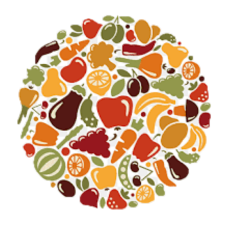

<p align="center">
  
</p>

<h1 align="center">
  FoodMaps
</h1>

<p align="center"> 
  Find the resources to help feed your family.
</p>

<br>

## 📈 Website Progress

FoodMaps is currently still in development. The website so far contains only an initial layout for
the home landing page. The layout was designed using purely HTML and CSS with no implementation for
user-interactivity as of right now. The website is not being hosted on the web and can be viewed by
downloading the project files. The website is in the design phase and there are ongoing plans to
build a completely interactive website.

## 🔍 View On Your Local Machine

1. Clone the repository or download the zip folder to your preferred directory

   After downloading the zip folder, make sure to extract the files to your preferred directory
   before moving to the next step

2. Navigate to the following file in the project folder
   ```
   ./client/views/index.html
   ```
3. Open the `index.html` file using your preferred web browser to view the `FoodMaps` home page.

## Remarks

Food insecurity is a major issue that affects millions of people worldwide. Although it is prevalent
everywhere, not many people are aware of what food insecurity really is or what it may look like.
Food insecurity is the feeling of not knowing when your next meal will be or where it is coming
from. Many families do not earn enough income to support themselves or their children, and many of
them live in areas where they do not have reliable access to affordable nutritious food. FoodMaps
was designed to help families find the resources needed to bring nutritious food to their homes.
However, FoodMaps alone can not directly help these families in need. Alongside finding resources
for families, the hope is that FoodMaps will also raise awareness for food insecurity, and will
motivate people to help by contributing a small portion of their time to volunteer or to learn a
little more about the issue.

## Contributors

- Gilman Huang
